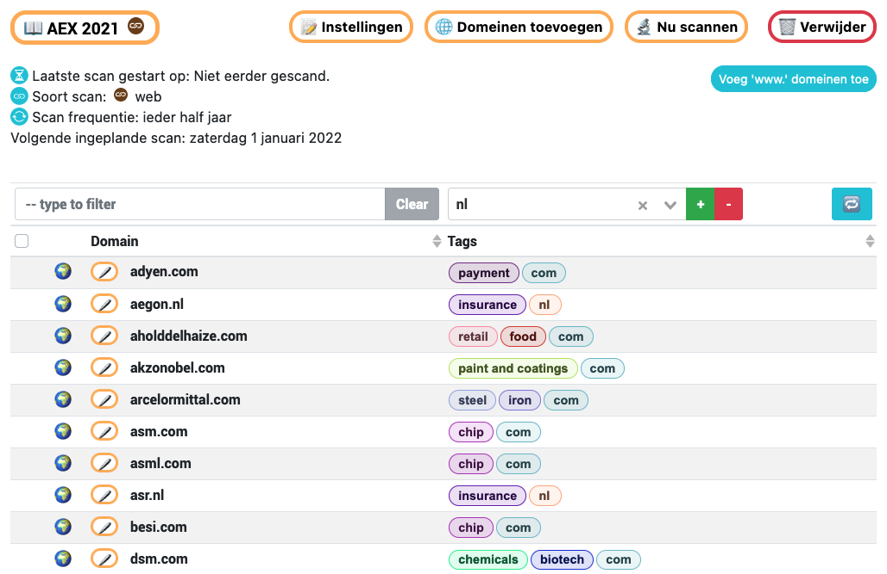
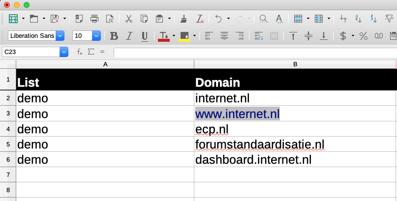
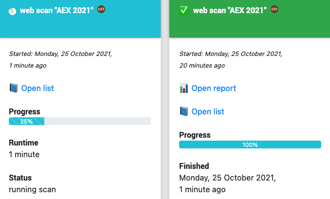
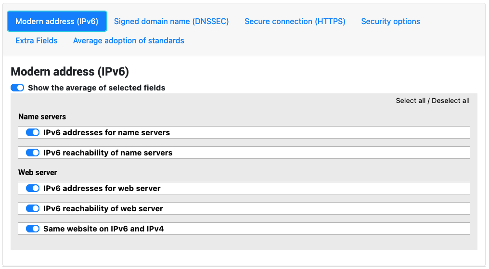
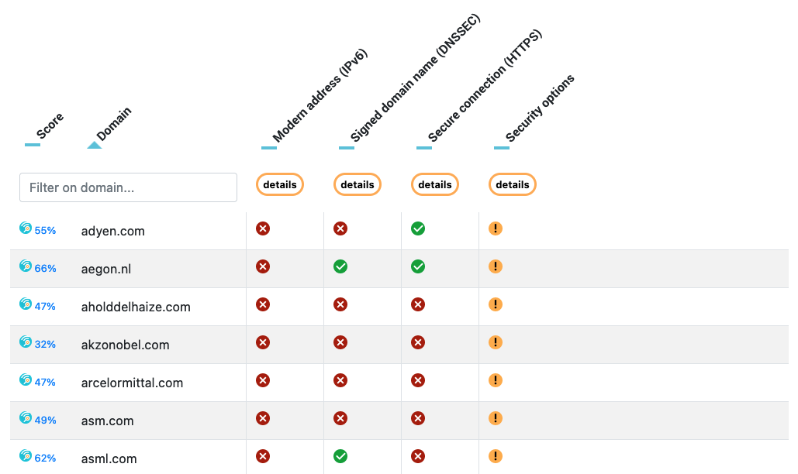
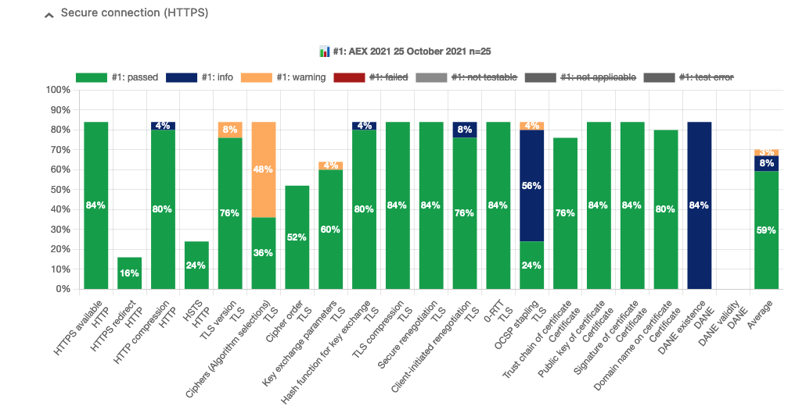
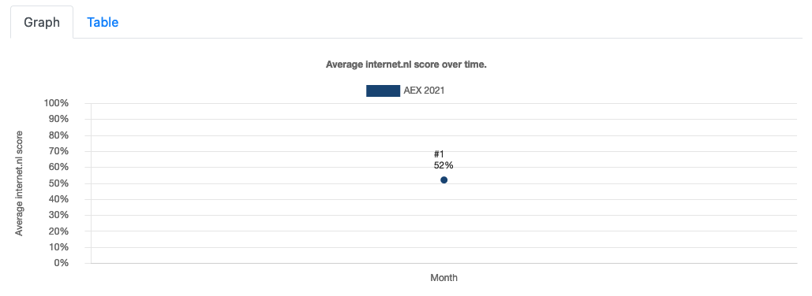
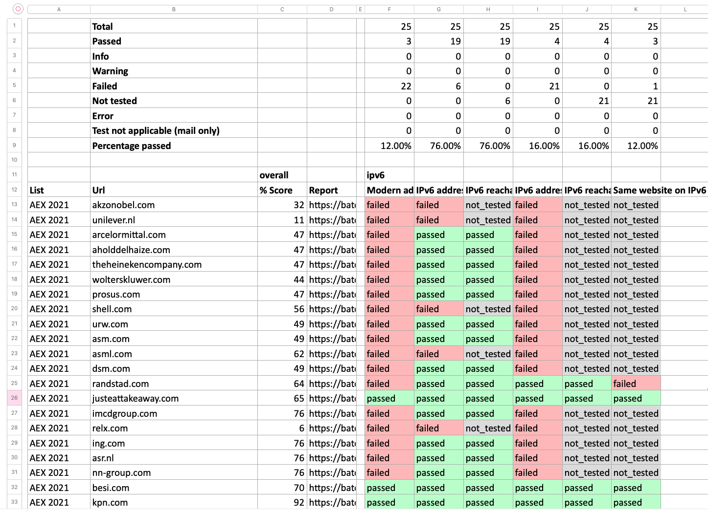
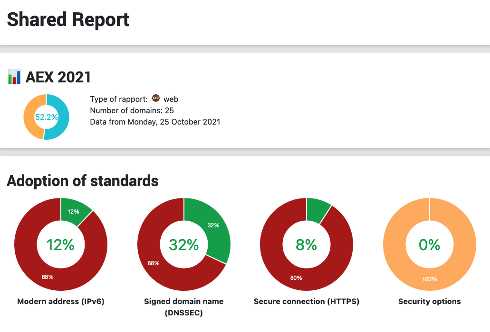
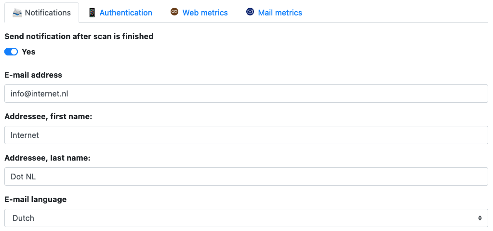

For quick installation: Follow [these quick instructions](https://github.com/internetstandards/Internet.nl-dashboard/blob/main/docs/render/markdown/1_installation.md) 
and watch [this 6 minute video](https://github.com/internetstandards/Internet.nl-dashboard/tree/main/docs/input/internet.nl%20dashboard%20installation%20video%20small.mp4).

# Internet.nl Dashboard
The internet.nl dashboard allows you to visualize batch scans from the internet.nl API. It allows:

- Multiple user accounts that manage their own lists of domains
- Domain managements in various lists up to thousands of domains per list
- Spreadsheet uploads / downloads of lists for offline bulk list editing
- Monitoring of ongoing scans
- Repeating scans
- Reports with results in tables, diagrams and comparisons to previous reports and spreadsheet exports
- Publishing reports for outside users, including automatic publishing
- E-Mail notifications on new reports
- User settings for what field is visible
- Second factor authentication
- Seamless internet.nl API integration

## Setup / installation

For quick installation: Follow [these quick instructions](https://github.com/internetstandards/Internet.nl-dashboard/blob/main/docs/render/markdown/1_installation.md) 
and watch [this 6 minute video](https://github.com/internetstandards/Internet.nl-dashboard/tree/main/docs/input/internet.nl%20dashboard%20installation%20video%20small.mp4).


## Screenshots

Some screenshots can be found at: https://dashboard.internet.nl/#/tour


List management has options for configuration, adding domains, direct scanning, scheduled scanning, 
sharing, exporting to spreadsheets and of course deletion.


It's possible to upload domains in Excel, ODS and CSV files domains. Examples are available on the upload page


Scans can be performed simultaneously. The scan monitor shows the progress of each scan and allows for cancelling scans.
The image shows several scans, of which one is still running. Our demo scan is finished and a report is ready.


The report is printer friendly and contains several graphs and a result table. It's even possible to download the 
report as a spreadsheet. In the screenshot all IPv6 metrics are now visible in the report. 
Enable or disable the entire group with one click and even include an average.


All results are visible in a table. The table is split into several categories and only shows the information that 
is needed. The table has a power feature: it's possible to compare data with a second report and see 
improvements/declines for all domains that are in both reports. 
It's possible to filter domains and view the complete report on internet.nl. Sorting of results is available.


These bar are more versatile than meets the eye. It's possible to compare reports (up to five) and they are available 
for every category and subcategory (such as IPv6, DNSSEC, TLS).


Every time a list is scanned, the data in the timeline grows. 
The timeline allow comparing multiple lists over time, showing multiple lines.


Reports can be exported to Excel, Libreoffice and CSV data. The Excel spreadsheet includes some 
statistics over the presented metrics.


Reports can be shared with the world or with a select audience. Using the sharing option anyone with the link, 
or anyone with the password, can view the report and take action.


Be notified when a scan is finished. The notification includes an overview of the scan results, including the major 
changes compared to the previous scan

## System requirements
The dashboard runs on modest hardware. For measuring, it uses a configurable internet.nl API account. The API comes 
from an internet.nl installation.

A server with 16 gig of ram, 320 gig disk space and 6 cores can handle dozens of accounts each with their own lists.
Lists up to 5000 domains process fine, albeit slower in busy periods. We've seen that working with lists of 25.000 domains 
or more is possible in this configuration with a scanning interval of every two weeks. Of course more beefy setups make
the dashboard more responsive in those kinds of high volume usage.


## Deployment information
The dashboard consists of three parts: a server config, the backend logic and a separate front-end. These are located
in the following repositories:

* Backend: https://github.com/internetstandards/Internet.nl-dashboard/
* Server: https://github.com/internetstandards/Internet.nl-dashboard-server/
* Frontend: https://github.com/internetstandards/Internet.nl-dashboard-frontend

The server ties all of these together, but it's very much possible to just run the backend and frontend yourself.

There is currently an open issue to make deployment of the dashboard easier in other environments.

The dashboard needs an internet.nl API to run, which requires a configured internet.nl instance. More information about
that is listed in the internet.nl repo: https://github.com/internetstandards/Internet.nl/


# Developer Documentation

[](https://shields.io)

These instructions will help you set up a development version of the dashboard.

Getting started
===============
Keywords: quickstart, installation


## 1: Install dependencies on your system
Setup your system to run this software using your favourite package manager.

**MacOS (brew)**
```bash
brew install git python3 direnv
```

**Debian Linux (apt)**
```bash
apt-get install git python3 direnv
```

**Redhat/CentOS (yum)**
```bash
yum install git python3 direnv
```

Or download and install each package separately:

- [make](https://www.gnu.org/software/make/) (required, pre-installed on most systems)
- [git](https://git-scm.com/downloads) (required, download and install)
- [python3](https://www.python.org/downloads/) (required, download and install, 3.8 or higher)
- [direnv](https://direnv.net/) (recommended, download and install, then follow [setup instructions](https://direnv.net/), see Direnv section below)
- [Docker](https://docs.docker.com/engine/installation/) (recommended, follow instructions to install.)
- [ShellCheck](https://github.com/koalaman/shellcheck#installing) (recommended, follow instructions to install

## 2: Install direnv correctly
Then set up direnv, the right command depends on your shell:

**BASH**
Add the following line at the end of the ~/.bashrc file:
```bash
eval "$(direnv hook bash)"
```

Make sure it appears even after rvm, git-prompt and other shell extensions that manipulate the prompt.

**ZSH**
Add the following line at the end of the ~/.zshrc file:
```bash
eval "$(direnv hook zsh)"
```

**FISH**
Add the following line at the end of the ~/.config/fish/config.fish file:

```bash
eval (direnv hook fish)
```

**TCSH**
Add the following line at the end of the ~/.cshrc file:

```bash
eval `direnv hook tcsh`
```


## 3: Generic install steps

In a directory of your choosing, download the software and enter the directory:

```bash
git clone --recursive https://https://github.com/internetstandards/Internet.nl-dashboard && cd Internet.nl-dashboard/
```

Running `make` once to create a development Virtualenv and setup the App and its dependencies. Running `make` without arguments by default also runs basic checks and tests to verify project code quality.

```bash
make
```

After completing successfully Web Security Map development server is available to run:

```bash
make run
```

If you want to run the frontend, or a worker, or the broker, run:

```bash
make run-frontend
```

Now visit the [website](http://127.0.0.1:8000/) and/or the
[admin website](http://127.0.0.1:8000/admin/) at http://127.0.0.1:8000 (credentials: dashboard_admin:admin).


To prepare the shell environment for local development. This way you can run the 'dashboard' command.

```bash
direnv allow
```

After completing successfully Dashboard is available to run. For example, to show a list of commands:

```bash
dashboard help
```

To create your first user:

```bash
dashboard createsuperuser
```

Development:
```
dashboard migrate
dashboard loaddata dashboard_development.json
```


#### Optional Steps

If your shell support tab completion you can get a complete list of supported commands by tabbing `make`:

```bash
make <tab><tab>
```

## 4: Common tasks

### Update dependencies/requirements

Python dependencies are managed using [pip-tools](https://github.com/jazzband/pip-tools). See `requirements.in` and `requirements-dev.in`.

For convenience the following command can be used to update all Python dependencies (within their version boundaries):

    make update_requirements

The dependency on Web Security Map is version pinned by a Git SHA in the Websecmap Gitlab repo. The following command will lookup the SHA for the current master in Gitlab, update the `requirements.in` file, update the dependencies, and even commit everything to Git.

    make update_requirement_websecmap

## FAQ / Troubleshooting

### Missing xcode (mac users)
During installation mac users might get the following error, due to not having xcode installed or updated.

```
xcrun: error: invalid active developer path (/Library/Developer/CommandLineTools), missing xcrun at: /Library/Developer/CommandLineTools/usr/bin/xcrun
```

You can update / install xcode tools with the following command:

```
xcode-select --install
```

### Missing Docker Daemon (mac users)
While docker is installed using brew in prior steps, you probably want to have
a gui controlling docker.

Docker for mac can be downloaded here:
https://download.docker.com/mac/stable/Docker.dmg

You can also visit the docker website and get the link using the time tested Oracle(tm) download strategy, here:
https://hub.docker.com/editions/community/docker-ce-desktop-mac


### Missing zstd or other stuff from LD

`brew install zstd`
`which zstd`
`set -x LDFLAGS -L/opt/homebrew/bin/zstd`
`set -x LDFLAGS -L/opt/homebrew/lib/ -L/opt/homebrew/openssl/lib`


### Cannot compile psycopg2 on m1 mac:
https://stackoverflow.com/questions/66888087/cannot-install-psycopg2-with-pip3-on-m1-mac
TLDR, run below commands and try again:
```json
export LDFLAGS="-L/opt/homebrew/opt/openssl@1.1/lib -L/opt/homebrew/opt/libpq/lib"
export CPPFLAGS="-I/opt/homebrew/opt/openssl@1.1/include -I/opt/homebrew/opt/libpq/include"
```


### Missing lib magic on mac:
Where you need the x86 version, because this library is x86 only due cffi not supporting m1:
`arch -x86_64 /usr/local/bin/brew install libmagic`

Because libmagic supresses loading errors, you'll only find out that the wrong binary is
getting loaded when adding print statements there. If the library doesn't load it's probably because:

```shell
/opt/local/lib/libmagic.dylib
dlopen(/opt/local/lib/libmagic.dylib, 6): image not found
/usr/local/lib/libmagic.dylib
dlopen(/usr/local/lib/libmagic.dylib, 6): image not found
/opt/homebrew/lib/libmagic.dylib
dlopen(/opt/homebrew/lib/libmagic.dylib, 6): no suitable image found.  Did find:
	/opt/homebrew/lib/libmagic.dylib: mach-o, but wrong architecture
	/opt/homebrew/Cellar/libmagic/5.41/lib/libmagic.1.dylib: mach-o, but wrong architecture
```

So you should install the Intel binary for this version.

You can use the alternative brew installation in /usr/local/bin
and run: `arch -x86_64 sh`, `cd /usr/local/bin`, `/brew install --build-from-source libmagic`

and run: `arch -x86_64 brew install libmagic`
You'll get an error but at least there is now an x64/intel file at: `/usr/local/lib/libmagic.dylib`


# issues  with celery < 5in
pkg_resources.extern.packaging.requirements.InvalidRequirement: Expected closing RIGHT_PARENTHESIS
    pytz (>dev)

add the following line:
`requirement_string = requirement_string.replace(">dev", "")`
just before
`parsed = parse_requirement(requirement_string)`
in
`/site-packages/pkg_resources/_vendor/packaging/requirements.py`
Probably line 36...

`/Users/stitch/Library/Caches/virtualenvs/internet.nl-dashboard/lib/python3.10/site-packages/pkg_resources/_vendor/packaging/`