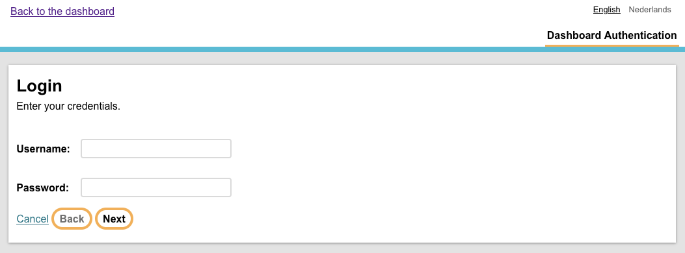
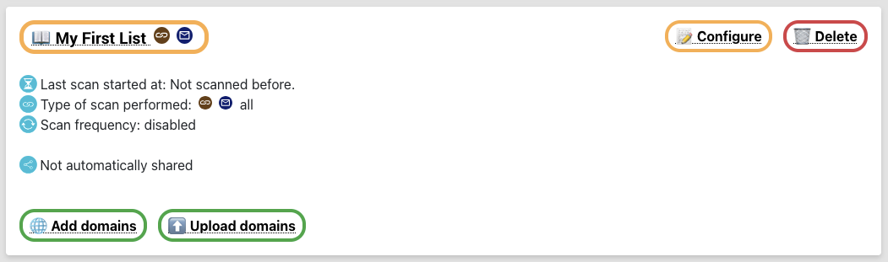
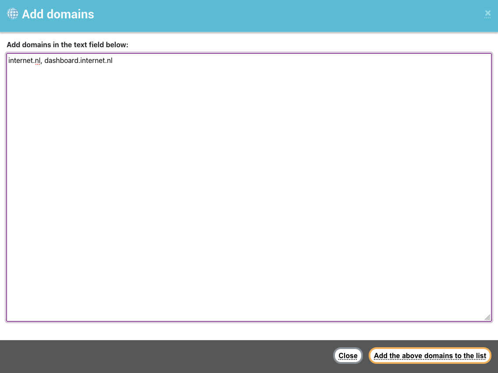
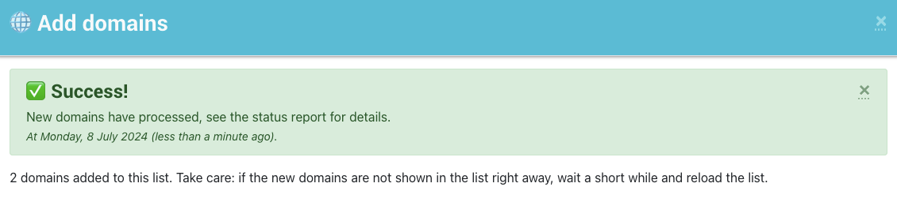
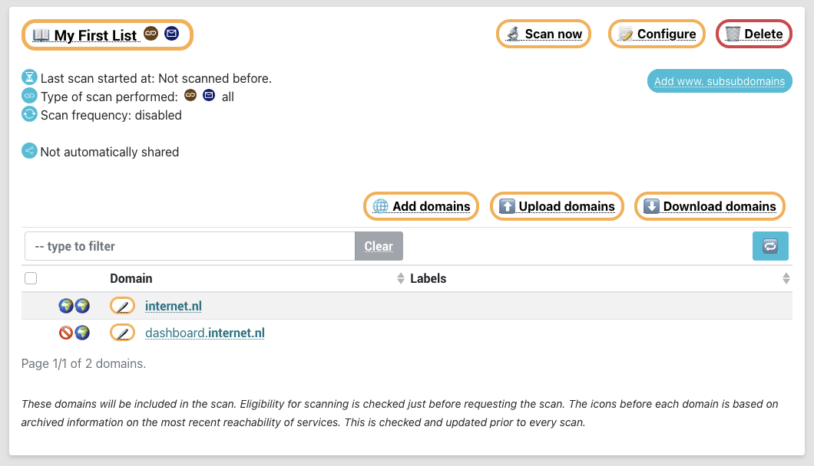
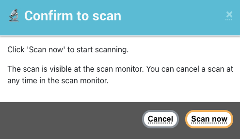
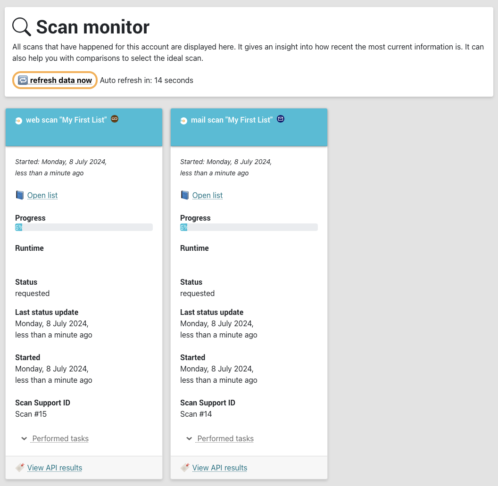
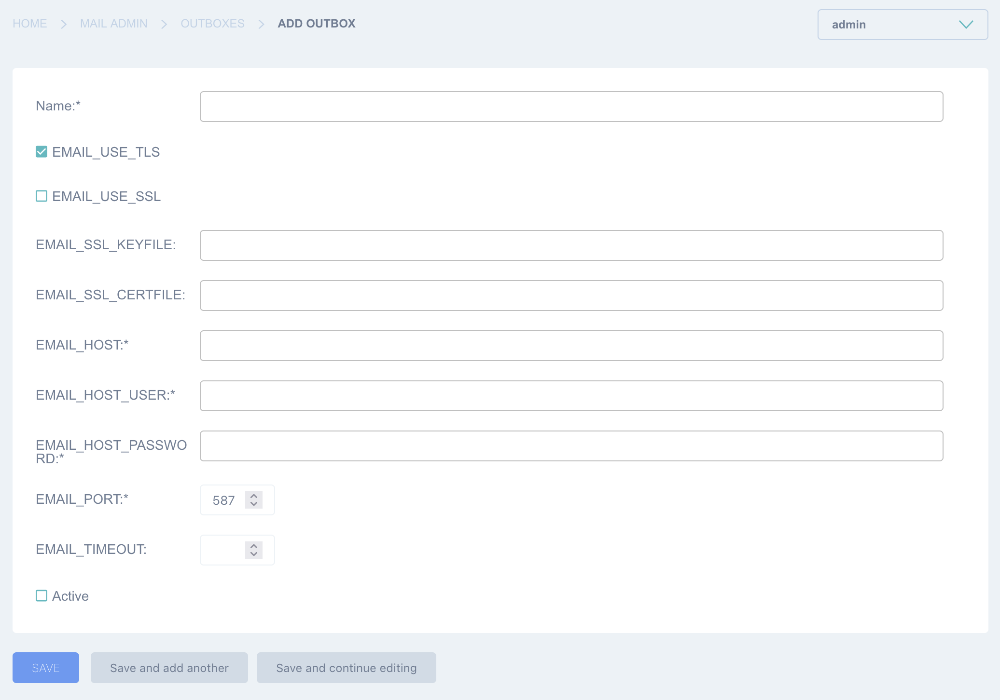

Installation guide
##################

.. sectnum::

This is a draft installation guide that will be ready in version 5.0 of the internet.nl dashboard.

The ticket for this issue: https://github.com/internetstandards/Internet.nl-dashboard/issues/495

Overview
=====================
Setting up the dashboard requires an operating system with docker. This setup was developed on mac and linux, on other
platforms your mileage may vary.

This tutorial will help you setting up an internet.nl dashboard instance. With this tutorial you should
be up and running within a few hours, gaining familiarity and confidence with with running a dashboard installation.

All configuration setup for your operating system is out of scope. This includes configuration of firewalls, security settings,
user management and so on.

For general and paid support with installations, updates and managing installations: please send a support request to vraag@internet.nl.

What do you need
----------------

* A computer with git and docker installed

  * 4 cores and 8 gigabyte of ram recommended

* Access to the command shell to perform installations commands
* Credential access to a running internet.nl API instance

  * This can be the official internet.nl instance
  * For information about running a batch instance,
  * See: https://github.com/internetstandards/Internet.nl/blob/main/documentation/README.md

* Optional: a domain name and SMTP settings

.. rst-class:: page-break
.. raw:: pdf

   PageBreak

Installation
============

Installation is mostly configuration work inside the dashboard. Some of the below steps will be automated when 5.0
is released.

Running the dashboard (during development of 5.0)
-------------------------------------------------

In the command shell, perform the following commands.

::

    git clone https://github.com/internetstandards/Internet.nl-dashboard/
    cd Internet.nl-dashboard
    git checkout 50
    docker compose up --build

After a short while your dashboard instance will be ready at :8000.

You can start and restart the application by running ``docker compose up --build``, use control+c to stop.

Running the dashboard (when 5.0 is released)
--------------------------------------------
Download the version you want to run. These can be downloaded from the releases page, here:
https://github.com/internetstandards/Internet.nl-dashboard/releases

Releases from version 5.0 and over support docker compose. You can also download a release
from the command line, with the following command:

::

    mkdir dashboard && cd dashboard
    wget https://github.com/internetstandards/Internet.nl-dashboard/archive/refs/tags/v5.0.tar.gz
    tar -zxvf v5.0.tar.gz
    docker compose up --build

After a short while your dashboard instance will be ready at :8000.

You can start and restart the application by running ``docker compose up --build``, use control+c to stop.

Load up default configuration
-----------------------------

This step will be automated before 5.0 is released. For now, run these commands to make sure default configuration is
loaded. For this you need to know the name of the 'backend' docker container.

You can retrieve the name of the backend docker container by running ``docker ps``. Below documentation assumes the
name of this container is ``internetnl-dashboard-backend-1``.

Load up the config:

.. code-block:: shell

    docker exec -ti internetnl-dashboard-backend-1 dashboard loaddata dashboard_production_default_account
    docker exec -ti internetnl-dashboard-backend-1 dashboard loaddata dashboard_production_example_email_templates
    docker exec -ti internetnl-dashboard-backend-1 dashboard loaddata dashboard_production_periodic_tasks
    docker exec -ti internetnl-dashboard-backend-1 dashboard loaddata dashboard_production_default_scanner_configuration
    docker exec -ti internetnl-dashboard-backend-1 dashboard loaddata dashboard_production_default_scan_policy

Setting up the first user
-------------------------

Create a new user:

``docker exec -ti internetnl-dashboard-backend-1 dashboard createsuperuser``

Associate that user to the default account, assuming the createsuperuser made user id 1:

``docker exec -ti internetnl-dashboard-database-1 psql --user dashboard -c "update internet_nl_dashboard_dashboarduser set account_id=1 where user_id=1;"``

Now you can login at :8000.

.. rst-class:: page-break
.. raw:: pdf

   PageBreak

Setting up scanning
-------------------

1. Visit the admin console on ``/admin/`` and log in. You might be redirected to the dashboard after login, so go
to the admin login panel again.

After going to ``/admin/`` again you will see this page:

.. image:: installation/admin_panel.png

2. Go to "🎛️ Dashboard Configuration" in the left menu

3. Set up the "general dashboard settings":

  1. DASHBOARD_FRONTEND_URL
  2. INTERNET_NL_API_URL
  3. CREDENTIAL_CHECK_URL
  4. INTERNET_NL_SCAN_TRACKING_NAME
  5. Click the save button

.. image:: installation/config_example_general_settings.png

4. Setup the API credentials for the account

  1. Go to the account management page: ``/admin/internet_nl_dashboard/account/``
  2. Click on the admin user
  3. Setup the "internet nl api username" and "new password" field and click save
  4. To test if the account was setup properly, use the 'Check API credentials'
  5. If the credentials are correctly configured the check will return a checkmark symbol, otherwise a cross symbol will be visible on the row of this account.

.. image:: installation/config_credential_check.png

You are now set to perform your first scan

.. rst-class:: page-break
.. raw:: pdf

   PageBreak

Performing your first scan
==========================

1. Visit the dashboard frontend and log in.

.. image:: installation/scan_login_link.png

2. Go to 'domains'
3. Create a new scan:

  1. Click on 'create new list'
  2. Enter the name for the list
  3. Set the list to scan both web and mail
  4. Save the list

.. image:: installation/scan_create_new_list.png

4. Add domains to the list

  1. Click 'add domains'
  2. Add the domains in the text field
  3. Click 'add the above domains to the list'
  4. After adding successfully, click 'close'

5. start a scan by clicking 'scan now' and confirming the scan

6. On the `scan monitor` page the list of currently running scans can be seen.

After a scan has finished a report will be ready.

Advanced configuration
======================

Setting up e-mail
-----------------
After a scan completes it's possible to receive an e-mail. An SMTP server has to be configured.

1. Visit the admin interface on ``/admin/`` and log in.

2. In the sidebar click "📨 Outboxes"

3. Fill in the form with all SMTP details and click save. Only one outbox is needed.

.. image:: installation/email_configured_outbox.png

.. rst-class:: page-break
.. raw:: pdf

   PageBreak

Background information
======================

Application component overview
------------------------------
The dashboard contains of three application components: dockerfile, backend and frontend.

The dockerfile will setup a complete dashboard with sample users and sample configuration. This is one command and
should be run on a system that runs docker, colima or another similar tool.

The backend is where all logic happens. List creation, result processing, session management and such. A few parts look
like the frontend: the login page, the password reset page and spreadsheet upload page. All other pages are either
redirects or interaction via JSON calls.

The frontend is the place where a users maintain lists, start scans, view and share reports. This is (mostly) the
'actual' website for day to day use.

Creating your own unique look and feel
--------------------------------------
The included default layout is an unbranded version of internet.nl, using the internet.nl styling. Only the logo's
and references have been disabled. The setting for using your own template is called 'SITE_LAYOUT_NAME' and is exposed
to the backend and frontend. The dashboard has not been optimized for custom branding yet, so your mileage to implement
this for your organization may vary.

