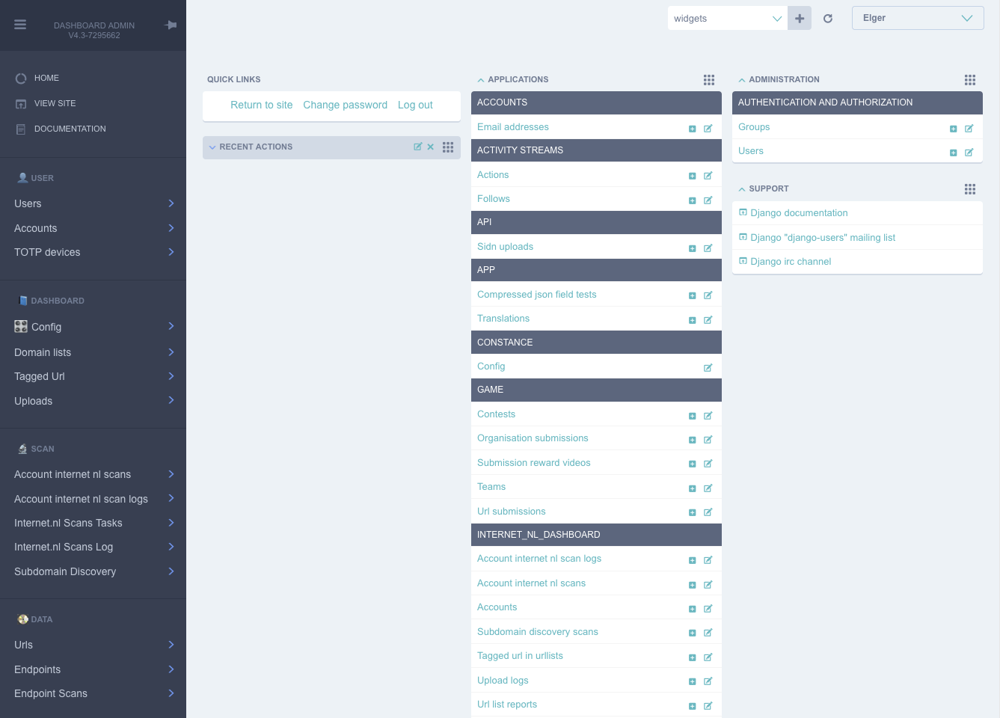
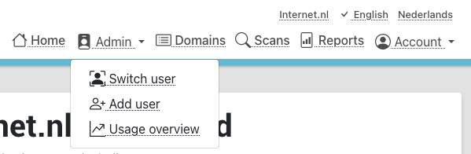

Installation (draft)
###############

This is a draft document that will be ready in version 5.0 of the internet.nl dashboard.
More about this in this issue: https://github.com/internetstandards/Internet.nl-dashboard/issues/495

Overview
=====================
While setting up an installation of the internet.nl dashboard is not more than running a single command, actually
managing the application requires knowledge about some concepts and choices made.

This tutorial will help you setting up and managing an internet.nl dashboard instance. With this tutorial you should
be up and running within a few hours, gaining familiarity and confidence with with running a dashboard installation.

For general and paid support with installations, updates and managing installations: please send a support request to vraag@internet.nl.

Application component overview
-------
The dashboard contains of three application components: dockerfile, backend and frontend.

The dockerfile will setup a complete dashboard with sample users and sample configuration. This is one command and
should be run on a system that runs docker, colima or another similar tool.

The backend is where all logic happens. List creation, result processing, session management and such. A few parts look
like the frontend: the login page, the password reset page and spreadsheet upload page. All other pages are either
redirects or interaction via JSON calls.

The frontend is the place where a users maintain lists, start scans, view and share reports. This is (mostly) the
'actual' website for day to day use.

Creating your own unique look and feel
-----
The included default layout is an unbranded version of internet.nl, using the internet.nl styling. Only the logo's
and references have been disabled. The setting for using your own template is called 'SITE_LAYOUT_NAME' and is exposed
to the backend and frontend. The dashboard has not been optimized for custom branding yet, so your mileage to implement
this for your organization may vary.

What do you need
--------
* a domain name / address for hosting the application and also being able to send e-mail (SMTP settings).
* a server, with certain specs...
* novice command line expertise probably
* ...

Installation
======

Setting up the server
----
Download the version you want to run. These can be downloaded from the releases page, here:
https://github.com/internetstandards/Internet.nl-dashboard/releases

Releases from version 5.0 and over support docker compose. You can also download a release
from the command line, with the following command:

``mkdir dashboard && cd dashboard``

``wget https://github.com/internetstandards/Internet.nl-dashboard/archive/refs/tags/v5.0.tar.gz``

``tar -zxvf v5.0.tar.gz``

``docker compose up --build``

After a short while your dashboard instance will be ready at :8000.

Setting up the first user
-----

Load up the first account which associates the first user made with above command.

``docker exec -ti internetnl-dashboard-backend-1 dashboard loaddata dashboard_production_default_account`
``docker exec -ti internetnl-dashboard-backend-1 dashboard loaddata dashboard_production_example_email_templates``
``docker exec -ti internetnl-dashboard-backend-1 dashboard loaddata dashboard_production_periodic_tasks``
``docker exec -ti internetnl-dashboard-backend-1 dashboard loaddata dashboard_production_default_scanner_configuration``
``docker exec -ti internetnl-dashboard-backend-1 dashboard loaddata dashboard_production_default_scan_policy``

# todo: load up scanners / scan configurations and default policies... has to be a fixture :)

Create a new user:

``docker exec -ti internetnl-dashboard-backend-1 dashboard createsuperuser``

Associate that user to the default account, assuming the createsuperuser made user id 1:
``docker exec -ti internetnl-dashboard-database-1 psql --user dashboard -c "update internet_nl_dashboard_dashboarduser set account_id=1 where user_id=1;"``

Now you can login at :8000.

Setting up scanning
---

1: Visit the admin console on ``/admin/`` and log in.
2: Go to "🎛️ Dashboard Configuration" in the left menu
3: Configure the variable INTERNET_NL_API_URL with url of your internet.nl batch instance
4: Configure the variable CREDENTIAL_CHECK_URL with url of your internet.nl batch instance
5: Go go accounts ``/admin/internet_nl_dashboard/account/``

Performing your first scan
---

1: Visit the dashboard frontend and log in
2: Create a new list, set it to web and mail scanning.
3: Add an example url such as internet.nl.
4: Hit "scan".
5: Visit the scans page to see the progress of the running scans
6: After the scans have completed, visit the reports page.

Setting up e-mail
-----
After a scan completes it's possible to receive an e-mail. An SMTP server has to be configured.

todo: add /static/images/vendor/internet_nl/clear.gif in de frontend, of haal deze weg.
todo johan: Report does not exist on location /source/dashboard/uploads/diskreports//original/UrlListReport/2.gson
diskreports werken niet, daar mist nog een mapping.

( todo: do you need direnv allow? probably not )

All configuration setup for your operating system is out of scope. This includes configuration of firewalls, security settings,
user management and so on. You can make your own choices. This includes what ports to use.

After starting the containers, the application can be reached on localhost on port 8042 unless otherwise configured.

todo: Dit is een `environment file`, .env. Daarin e.e.a. inrichten. Maak de file aan met deze inhoud.

Backend application
----
1: Setting the SECRET_KEY and FIELD_ENCRYPTION_KEY (will happen on installation?) Automate this...
-> this is generated once. Hoeft niet want gegenereerd op eerste startup. (geef aan johan het command om er een te maken).

Todo: How do you make a secret key and field encryption key?

2: Creating the first application user (automated probably)
user = dashboard_admin,  createsuperuser. Eerste user is blanco.
Ik geef de commands aan Johan.

3: Installing default fixtures
* dashboard_production_dummy_user
* dashboard_production_periodic_tasks
* dashboard_production_example_email_templates

Configuring settings in the admin interface
---

Connection to the internet.nl API
----
Via

Possibly an account has to be added and connected to the user. Should this be a command line thing?

todo: add security considerations

Application security tips
-----

1: delete the first account and first user (make sure you have a different superuser set up and associated)
2: do not use the same API credentials as user accounts

Backend application
======================
The backend application creates reports, manages scans and talks to the internet.nl API. This backend
is written in python/django and communicates via JSON calls over HTTP.

When the server is installed, the application uses several defaults.

The admin interface
--------------
All data in the application is visible in the admin interface. This interface should only be reachable by a limited
amount of users. The path for limited access should be /admin/.

The admin interface can be viewed on the url ``/admin/``. Visiting this requires an application user which was setup
in the chapter 'server installation'. After logging in, the following interface is presented:

The interface exposes all database tables but more importantly Users/Account management features and application
configuration. User/account management is discussed in a separate chapter. (todo: link).

Configuration options
------
Configuration of the backend is done via the page ``/admin/constance/config/``. There are dozens of configuration
options each with explanation of what it does. Most settings involving domain names have the value internet.nl or
example.com as settings. These have to be adjusted to your installation domain.

SMTP settings for mails... (outboxes)

Frontend Application
====================

1: does it need configuration?
2: how to install it?
3: how to update it?

Admin shorthands present in the frontend application.
-------
For admins there are several shortcuts available that require some additional work in the backend interface.

These features allow account impersonation, quickly adding accounts+users (with the same name) and statistics.

Backend shell-level management
===============
The bash shell is used for manually updating and installing the application.

